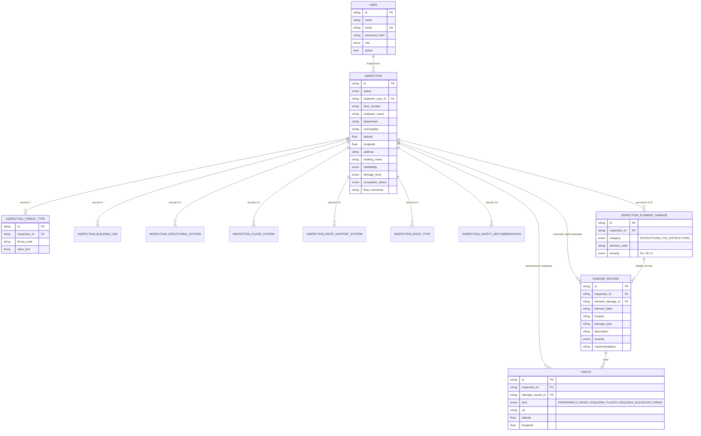

# Modelo Entidad-Relación (ERD)

Corresponde al esquema PostgreSQL objetivo (`prisma/schema.prisma` / `sql/postgresql_schema.sql`). La
demostración usa un espejo funcional en SQLite (`src/db/schema.sql`).

## Notas de diseño

* **Catálogos vs. captura de campo**: los catálogos cerrados del formulario (amenazas, usos, sistemas
  estructurales, elementos, recomendaciones) **no** son tablas de base de datos — viven como datos
  estáticos versionados en código (`src/domain/catalog.ts`), porque a diferencia de una metodología de
  índice ponderado (p.ej. WABIM) no hay coeficientes numéricos configurables que un administrador deba
  recalibrar. Las tablas `inspection_*` son la *captura de campo* real.
* **Checklist oficial vs. extensión aditiva**: `inspection_element_damages` (secciones 9-10) es el
  checklist de severidad N/L·M·S del formulario impreso. `damage_records` es una extensión aditiva
  (pedida en los requerimientos funcionales, no en el formulario impreso) que permite adjuntar fotos y
  descripción a un elemento ya marcado M o S — ver `docs/ANALISIS-Y-ARQUITECTURA.md` §3, ambigüedad A4.
* **Un solo campo de clasificación**: `habitability` / `damage_level` representan el mismo dato que el
  formulario impreso muestra dos veces (secciones 2 y 12) — ver ambigüedad A3.
